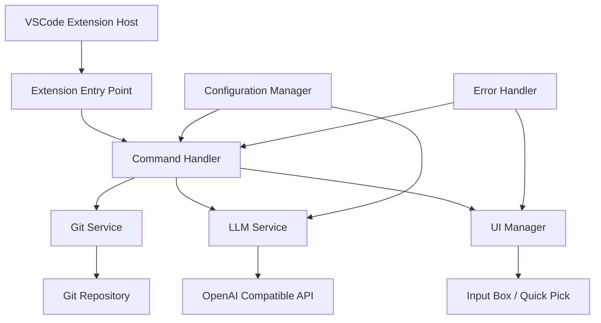
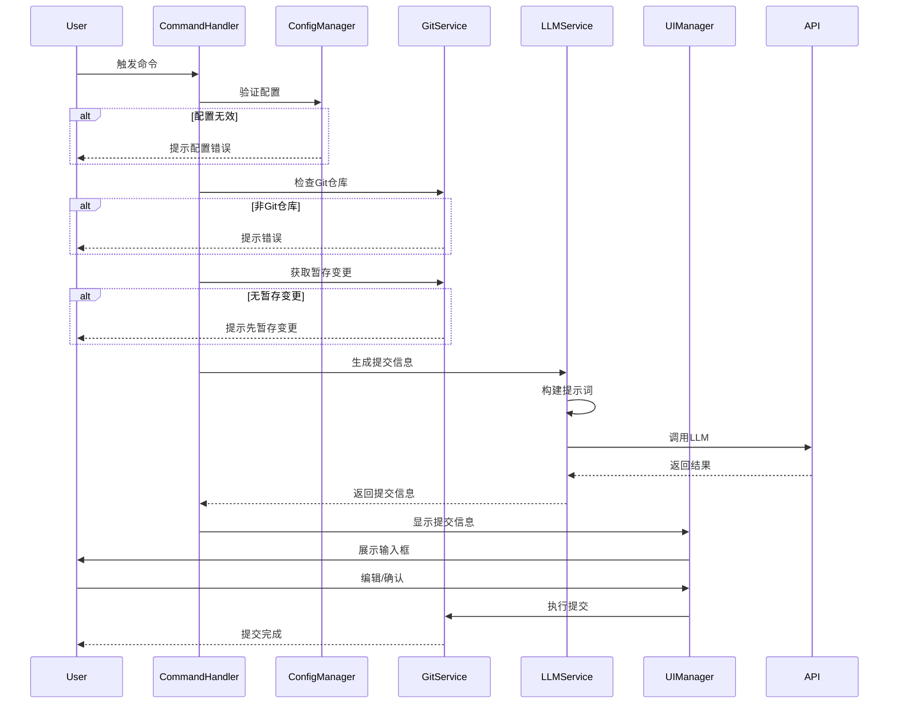

# 设计文档

## 概述

本文档描述了AI Git提交信息生成器VSCode插件的技术设计。该插件通过集成OpenAI兼容的LLM服务，自动分析Git变更并生成高质量的提交信息，帮助开发者提高工作效率。

插件采用模块化架构，包含配置管理、Git集成、LLM服务调用、用户界面等核心模块。设计遵循VSCode扩展开发最佳实践，确保良好的性能和用户体验。

## 架构

### 整体架构图



### 模块说明

1. **Extension Entry Point（扩展入口）**: 插件激活和注册命令
2. **Command Handler（命令处理器）**: 协调各模块完成提交信息生成流程
3. **Git Service（Git服务）**: 封装Git操作，获取变更信息
4. **LLM Service（LLM服务）**: 调用OpenAI兼容API生成提交信息
5. **Configuration Manager（配置管理器）**: 管理用户配置
6. **UI Manager（界面管理器）**: 处理用户交互界面
7. **Error Handler（错误处理器）**: 统一错误处理和用户反馈

## 组件和接口

### 1. Extension Entry Point

**职责**: 插件生命周期管理和命令注册

**接口**:
```typescript
export function activate(context: vscode.ExtensionContext): void
export function deactivate(): void
```

**实现细节**:
- 在 `activate` 函数中注册命令
- 初始化各个服务模块
- 订阅配置变更事件
- 注册状态栏项

### 2. Configuration Manager

**职责**: 管理插件配置项

**配置项**:
```typescript
interface ExtensionConfig {
  apiEndpoint: string;      // API端点URL
  apiKey: string;           // API密钥
  modelName: string;        // 模型名称
  language: string;         // 提交信息语言
  commitFormat: string;     // 提交格式（conventional/simple）
  maxTokens: number;        // 最大token数
  temperature: number;      // 温度参数
}
```

**接口**:
```typescript
class ConfigurationManager {
  getConfig(): ExtensionConfig
  validateConfig(): ValidationResult
  updateConfig(key: string, value: any): Promise<void>
}
```

### 3. Git Service

**职责**: 封装Git操作，获取仓库变更信息

**接口**:
```typescript
class GitService {
  isGitRepository(): boolean
  getStagedChanges(): Promise<GitChange[]>
  getDiff(filePath: string): Promise<string>
  getRepositoryRoot(): string
  commitWithMessage(message: string): Promise<void>
}

interface GitChange {
  path: string;
  status: 'added' | 'modified' | 'deleted' | 'renamed';
  diff: string;
}
```

**实现细节**:
- 使用VSCode内置的Git扩展API
- 过滤二进制文件和大文件（>100KB）
- 限制diff内容长度以避免超出LLM上下文限制
- 处理各种Git状态（未初始化、无变更等）

### 4. LLM Service

**职责**: 调用OpenAI兼容API生成提交信息

**接口**:
```typescript
class LLMService {
  generateCommitMessage(changes: GitChange[], config: ExtensionConfig): Promise<string>
  private buildPrompt(changes: GitChange[]): string
  private callAPI(prompt: string, config: ExtensionConfig): Promise<string>
}

interface APIRequest {
  model: string;
  messages: Message[];
  max_tokens?: number;
  temperature?: number;
}

interface Message {
  role: 'system' | 'user' | 'assistant';
  content: string;
}
```

**提示词设计**:
```typescript
const SYSTEM_PROMPT = `你是一个专业的Git提交信息生成助手。
请根据提供的代码变更内容，生成简洁、专业的提交信息。

要求：
1. 使用约定式提交格式（Conventional Commits）
2. 标题不超过50个字符
3. 如果变更复杂，提供详细描述
4. 使用{language}语言
5. 格式：<type>(<scope>): <subject>

常用类型：
- feat: 新功能
- fix: 修复bug
- docs: 文档更新
- style: 代码格式调整
- refactor: 重构
- test: 测试相关
- chore: 构建/工具相关`;

const USER_PROMPT_TEMPLATE = `请为以下代码变更生成提交信息：

{changes}

请直接返回提交信息，不需要额外解释。`;
```

**实现细节**:
- 使用 `fetch` 或 `axios` 调用API
- 实现请求超时机制（30秒）
- 实现重试逻辑（最多3次）
- 处理API限流和错误响应
- 支持流式响应（可选）

### 5. Command Handler

**职责**: 协调各模块完成完整的生成流程

**接口**:
```typescript
class CommandHandler {
  async generateCommitMessage(): Promise<void>
  private validatePrerequisites(): Promise<boolean>
  private showProgress<T>(task: Promise<T>, message: string): Promise<T>
}
```

**执行流程**:


### 6. UI Manager

**职责**: 管理用户交互界面

**接口**:
```typescript
class UIManager {
  showCommitMessageInput(initialMessage: string): Promise<CommitAction>
  showError(message: string, actions?: string[]): Promise<string | undefined>
  showProgress(message: string): vscode.Progress<{message?: string}>
  showStatusBarMessage(message: string, timeout?: number): void
}

interface CommitAction {
  action: 'commit' | 'regenerate' | 'cancel';
  message?: string;
}
```

**UI组件**:
1. **输入框**: 使用 `vscode.window.showInputBox` 显示和编辑提交信息
2. **快速选择**: 使用 `vscode.window.showQuickPick` 提供操作选项
3. **进度指示器**: 使用 `vscode.window.withProgress` 显示加载状态
4. **状态栏**: 使用 `vscode.window.createStatusBarItem` 显示快捷入口
5. **通知**: 使用 `vscode.window.showInformationMessage/showErrorMessage` 显示反馈

### 7. Error Handler

**职责**: 统一错误处理和日志记录

**接口**:
```typescript
class ErrorHandler {
  handleError(error: Error, context: string): void
  logError(error: Error, context: string): void
  getUserFriendlyMessage(error: Error): string
}

enum ErrorType {
  ConfigurationError,
  GitError,
  APIError,
  NetworkError,
  UnknownError
}
```

**错误处理策略**:
- 配置错误：引导用户到设置页面
- Git错误：显示Git相关提示
- API错误：显示具体错误信息和重试选项
- 网络错误：提示检查网络连接
- 未知错误：记录详细日志并显示通用错误信息

## 数据模型

### Git变更数据

```typescript
interface GitChange {
  path: string;              // 文件路径
  status: ChangeStatus;      // 变更状态
  diff: string;              // 差异内容
  additions: number;         // 新增行数
  deletions: number;         // 删除行数
}

enum ChangeStatus {
  Added = 'A',
  Modified = 'M',
  Deleted = 'D',
  Renamed = 'R',
  Copied = 'C'
}
```

### LLM请求/响应

```typescript
interface LLMRequest {
  model: string;
  messages: Message[];
  max_tokens?: number;
  temperature?: number;
  stream?: boolean;
}

interface LLMResponse {
  id: string;
  object: string;
  created: number;
  model: string;
  choices: Choice[];
  usage?: Usage;
}

interface Choice {
  index: number;
  message: Message;
  finish_reason: string;
}

interface Usage {
  prompt_tokens: number;
  completion_tokens: number;
  total_tokens: number;
}
```

## 错误处理

### 错误分类和处理

1. **配置错误**
   - 缺失必需配置项
   - 无效的API端点格式
   - 处理：显示配置向导，引导用户完成配置

2. **Git错误**
   - 非Git仓库
   - 无暂存变更
   - Git命令执行失败
   - 处理：显示具体错误信息和操作建议

3. **API错误**
   - 认证失败（401）
   - 限流（429）
   - 模型不存在（404）
   - 服务器错误（500）
   - 处理：显示错误详情，提供重试选项

4. **网络错误**
   - 连接超时
   - DNS解析失败
   - 处理：提示检查网络和API端点配置

### 错误恢复机制

- API调用失败：自动重试3次，指数退避
- 网络超时：30秒超时，可配置
- 部分失败：允许用户手动输入提交信息

## 测试策略

### 单元测试

**测试范围**:
- Configuration Manager: 配置读取、验证、更新
- Git Service: Git命令执行、diff解析
- LLM Service: 提示词构建、API调用、响应解析
- Error Handler: 错误分类、消息转换

**测试工具**: Jest + @types/vscode

**测试覆盖率目标**: >80%

### 集成测试

**测试场景**:
1. 完整的提交信息生成流程
2. 配置变更后的行为
3. 各种Git状态下的处理
4. API错误场景的处理

**测试工具**: VSCode Extension Test Runner

### 手动测试

**测试清单**:
- [ ] 在不同的Git仓库中测试
- [ ] 测试各种类型的代码变更
- [ ] 测试不同的OpenAI兼容服务（OpenAI、Azure OpenAI、本地模型等）
- [ ] 测试错误场景和边界情况
- [ ] 测试用户界面的响应性和易用性

## 性能考虑

### 优化策略

1. **Diff内容限制**
   - 单个文件diff限制：5000行
   - 总diff限制：20000字符
   - 超出限制时提供摘要

2. **API调用优化**
   - 使用合理的max_tokens限制（500-1000）
   - 缓存最近的生成结果（可选）
   - 支持取消正在进行的请求

3. **响应时间**
   - Git操作：<500ms
   - API调用：<10s（取决于服务）
   - UI响应：<100ms

4. **资源使用**
   - 内存占用：<50MB
   - 不阻塞VSCode主线程
   - 异步处理所有IO操作

## 安全考虑

1. **API密钥安全**
   - 使用VSCode SecretStorage存储API密钥
   - 不在日志中记录敏感信息
   - 支持环境变量配置

2. **代码隐私**
   - 明确告知用户代码将发送到LLM服务
   - 提供选项禁用特定文件类型
   - 支持本地LLM服务

3. **输入验证**
   - 验证所有用户输入
   - 清理和转义特殊字符
   - 防止注入攻击

## 扩展性设计

### 未来功能扩展

1. **多语言支持**
   - 支持多种提交信息语言
   - 本地化UI文本

2. **自定义提示词**
   - 允许用户自定义提示词模板
   - 支持团队共享提示词配置

3. **提交历史学习**
   - 分析项目历史提交
   - 学习项目特定的提交风格

4. **批量提交**
   - 支持为多个变更集生成提交信息
   - 智能拆分大型变更

5. **集成其他工具**
   - 集成Issue跟踪系统
   - 自动关联Issue编号

### 插件架构扩展点

- 提供API供其他插件调用
- 支持自定义LLM服务适配器
- 支持自定义提交格式验证器
