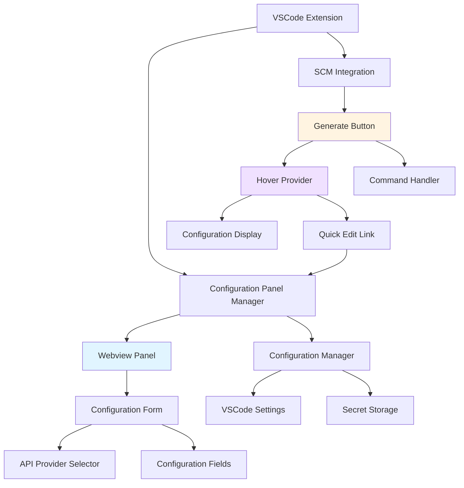

# 设计文档

## 概述

本文档描述了AI Git Commit插件配置面板增强功能的技术设计。该功能将通过专用配置面板、API提供商下拉选择器和源代码管理视图深度集成，显著改善用户配置LLM服务的体验。设计重点关注用户体验的流畅性和配置信息的可见性。

核心改进包括：
1. 将项目名称统一为"AI Git Commit"
2. 创建专用的Webview配置面板替代现有配置向导
3. 实现API提供商下拉选择器并自动填充默认值
4. 在源代码管理视图中添加首选操作按钮
5. 实现悬停提示显示当前配置和快速编辑入口

## 架构

### 整体架构图



### 模块说明

1. **Configuration Panel Manager**: 管理Webview配置面板的生命周期
2. **Webview Panel**: 承载配置表单的Webview容器
3. **API Provider Selector**: 下拉选择器组件，包含预定义提供商
4. **SCM Integration**: 源代码管理视图集成模块
5. **Hover Provider**: 提供悬停提示和配置信息显示
6. **Quick Edit Link**: 从悬停提示跳转到配置面板的快捷入口

## 组件和接口

### 1. Configuration Panel Manager

**职责**: 管理配置面板的创建、显示和消息通信

**接口**:
```typescript
class ConfigurationPanelManager {
  private panel: vscode.WebviewPanel | undefined;
  private context: vscode.ExtensionContext;
  private configManager: ConfigurationManager;

  constructor(context: vscode.ExtensionContext, configManager: ConfigurationManager);
  
  /**
   * 显示配置面板
   */
  showPanel(): void;
  
  /**
   * 处理来自Webview的消息
   */
  private handleMessage(message: WebviewMessage): Promise<void>;
  
  /**
   * 获取Webview HTML内容
   */
  private getWebviewContent(): string;
  
  /**
   * 加载当前配置到面板
   */
  private loadCurrentConfig(): Promise<void>;
  
  /**
   * 保存配置
   */
  private saveConfig(config: ConfigurationData): Promise<void>;
  
  /**
   * 验证配置
   */
  private validateConfig(config: ConfigurationData): ValidationResult;
}

interface WebviewMessage {
  command: 'load' | 'save' | 'validate' | 'providerChanged';
  data?: any;
}

interface ConfigurationData {
  provider: string;
  apiKey: string;
  baseUrl: string;
  modelName: string;
}
```

**实现细节**:
- 使用单例模式，确保只有一个配置面板实例
- 面板关闭时清理资源
- 支持面板重新打开时恢复状态
- 使用postMessage进行Webview与Extension的双向通信

### 2. API Provider Selector

**职责**: 提供API提供商选择和默认值管理

**预定义提供商配置**:
```typescript
interface ProviderConfig {
  id: string;
  name: string;
  defaultBaseUrl: string;
  defaultModel: string;
  description: string;
}

const PROVIDERS: ProviderConfig[] = [
  {
    id: 'openai',
    name: 'OpenAI',
    defaultBaseUrl: 'https://api.openai.com/v1',
    defaultModel: 'gpt-3.5-turbo',
    description: 'OpenAI官方API服务'
  },
  {
    id: 'azure-openai',
    name: 'Azure OpenAI',
    defaultBaseUrl: 'https://<your-resource>.openai.azure.com',
    defaultModel: 'gpt-35-turbo',
    description: 'Microsoft Azure OpenAI服务'
  },
  {
    id: 'ollama',
    name: 'Ollama',
    defaultBaseUrl: 'http://localhost:11434/v1',
    defaultModel: 'llama2',
    description: '本地Ollama服务'
  },
  {
    id: 'custom',
    name: '其他',
    defaultBaseUrl: '',
    defaultModel: '',
    description: '自定义OpenAI兼容服务'
  }
];

class ProviderManager {
  /**
   * 获取所有提供商
   */
  getProviders(): ProviderConfig[];
  
  /**
   * 根据ID获取提供商配置
   */
  getProviderById(id: string): ProviderConfig | undefined;
  
  /**
   * 获取提供商的默认配置
   */
  getDefaultConfig(providerId: string): Partial<ConfigurationData>;
}
```

**Webview中的实现**:
```html
<select id="provider-selector" class="form-control">
  <option value="openai">OpenAI</option>
  <option value="azure-openai">Azure OpenAI</option>
  <option value="ollama">Ollama</option>
  <option value="custom">其他</option>
</select>
```

**行为**:
- 选择提供商时自动填充Base URL和Model Name
- 选择"其他"时清空默认值，允许用户自定义
- 保存当前选择的提供商ID到配置

### 3. Webview Configuration Form

**职责**: 提供用户友好的配置表单界面

**HTML结构**:
```html
<!DOCTYPE html>
<html>
<head>
  <meta charset="UTF-8">
  <meta name="viewport" content="width=device-width, initial-scale=1.0">
  <title>AI Git Commit 配置</title>
  <style>
    /* VSCode主题适配样式 */
  </style>
</head>
<body>
  <div class="container">
    <h1>AI Git Commit 配置</h1>
    
    <form id="config-form">
      <div class="form-group">
        <label for="provider-selector">API提供商</label>
        <select id="provider-selector" class="form-control">
          <!-- 选项 -->
        </select>
        <small class="form-text">选择您的LLM服务提供商</small>
      </div>
      
      <div class="form-group">
        <label for="api-key">API密钥</label>
        <input type="password" id="api-key" class="form-control" required>
        <small class="form-text">您的API密钥将安全存储</small>
      </div>
      
      <div class="form-group">
        <label for="base-url">Base URL</label>
        <input type="url" id="base-url" class="form-control" required>
        <small class="form-text">API端点地址</small>
      </div>
      
      <div class="form-group">
        <label for="model-name">模型名称</label>
        <input type="text" id="model-name" class="form-control" required>
        <small class="form-text">使用的模型名称</small>
      </div>
      
      <div class="form-actions">
        <button type="submit" class="btn btn-primary">保存</button>
        <button type="button" class="btn btn-secondary" id="cancel-btn">取消</button>
      </div>
      
      <div id="validation-message" class="message"></div>
    </form>
  </div>
  
  <script>
    // Webview脚本
  </script>
</body>
</html>
```

**JavaScript逻辑**:
```javascript
const vscode = acquireVsCodeApi();

// 加载配置
window.addEventListener('message', event => {
  const message = event.data;
  if (message.command === 'loadConfig') {
    document.getElementById('provider-selector').value = message.data.provider;
    document.getElementById('api-key').value = message.data.apiKey;
    document.getElementById('base-url').value = message.data.baseUrl;
    document.getElementById('model-name').value = message.data.modelName;
  }
});

// 提供商变更处理
document.getElementById('provider-selector').addEventListener('change', (e) => {
  vscode.postMessage({
    command: 'providerChanged',
    data: { provider: e.target.value }
  });
});

// 表单提交
document.getElementById('config-form').addEventListener('submit', (e) => {
  e.preventDefault();
  const config = {
    provider: document.getElementById('provider-selector').value,
    apiKey: document.getElementById('api-key').value,
    baseUrl: document.getElementById('base-url').value,
    modelName: document.getElementById('model-name').value
  };
  vscode.postMessage({ command: 'save', data: config });
});

// 请求加载配置
vscode.postMessage({ command: 'load' });
```

### 4. SCM View Integration

**职责**: 在源代码管理视图中集成生成按钮和悬停提示

**package.json配置更新**:
```json
{
  "contributes": {
    "commands": [
      {
        "command": "aiGitCommit.generateMessage",
        "title": "生成AI提交信息",
        "category": "AI Git Commit",
        "icon": "$(sparkle)"
      }
    ],
    "menus": {
      "scm/title": [
        {
          "command": "aiGitCommit.generateMessage",
          "group": "navigation@1",
          "when": "scmProvider == git"
        }
      ]
    }
  }
}
```

**按钮位置**: 
- 放置在SCM标题栏的navigation组
- 使用@1优先级确保显示在前面
- 使用sparkle图标($(sparkle))表示AI功能

### 5. Hover Provider

**职责**: 提供悬停提示显示配置信息和编辑入口

**接口**:
```typescript
class SCMHoverProvider {
  private configManager: ConfigurationManager;
  
  constructor(configManager: ConfigurationManager);
  
  /**
   * 注册悬停提示提供者
   */
  register(context: vscode.ExtensionContext): void;
  
  /**
   * 生成悬停内容
   */
  private async generateHoverContent(): Promise<vscode.MarkdownString>;
  
  /**
   * 格式化API密钥显示（部分遮蔽）
   */
  private maskApiKey(apiKey: string): string;
}
```

**实现方式**:
由于VSCode不直接支持SCM按钮的悬停提示自定义，我们使用以下方案：

1. **方案A: 使用Command的tooltip属性**
```typescript
// 动态更新命令的tooltip
vscode.commands.registerCommand('aiGitCommit.updateTooltip', async () => {
  const config = await configManager.getConfig();
  const tooltip = generateTooltipText(config);
  
  // 更新命令注册
  vscode.commands.executeCommand('setContext', 'aiGitCommit.tooltip', tooltip);
});

function generateTooltipText(config: ExtensionConfig): string {
  if (!config.apiKey) {
    return '未配置 - 点击配置AI Git Commit';
  }
  
  return `AI Git Commit
提供商: ${config.provider || 'OpenAI'}
API密钥: ${maskApiKey(config.apiKey)}
Base URL: ${config.apiEndpoint}
模型: ${config.modelName}

点击生成提交信息
右键编辑配置`;
}

function maskApiKey(key: string): string {
  if (!key || key.length < 8) return '****';
  return key.substring(0, 4) + '****' + key.substring(key.length - 4);
}
```

2. **方案B: 使用StatusBar Item（备选）**
```typescript
// 在SCM视图附近添加状态栏项
const scmStatusItem = vscode.window.createStatusBarItem(
  vscode.StatusBarAlignment.Left,
  100
);
scmStatusItem.text = '$(sparkle) AI Commit';
scmStatusItem.tooltip = new vscode.MarkdownString(
  `**当前配置**\n\n` +
  `提供商: ${config.provider}\n` +
  `模型: ${config.modelName}\n\n` +
  `[编辑配置](command:aiGitCommit.configureSettings)`
);
scmStatusItem.command = 'aiGitCommit.generateMessage';
```

**悬停内容格式**:
```
AI Git Commit
━━━━━━━━━━━━━━━━━━━━
提供商: OpenAI
API密钥: sk-****abc123
Base URL: https://api.openai.com/v1
模型: gpt-3.5-turbo

点击生成提交信息
[编辑配置]
```

### 6. Configuration Manager 增强

**职责**: 扩展现有ConfigurationManager以支持新功能

**新增接口**:
```typescript
class ConfigurationManager {
  // 现有方法...
  
  /**
   * 获取API提供商
   */
  getProvider(): string;
  
  /**
   * 设置API提供商
   */
  setProvider(provider: string): Promise<void>;
  
  /**
   * 获取完整配置（包括提供商）
   */
  async getFullConfig(): Promise<FullConfig>;
  
  /**
   * 保存完整配置
   */
  async saveFullConfig(config: FullConfig): Promise<void>;
  
  /**
   * 获取配置摘要（用于显示）
   */
  getConfigSummary(): Promise<ConfigSummary>;
}

interface FullConfig extends ExtensionConfig {
  provider: string;
}

interface ConfigSummary {
  provider: string;
  apiKeyMasked: string;
  baseUrl: string;
  modelName: string;
  isConfigured: boolean;
}
```

**配置存储结构**:
```typescript
// VSCode Settings (settings.json)
{
  "aiGitCommit.provider": "openai",
  "aiGitCommit.apiEndpoint": "https://api.openai.com/v1",
  "aiGitCommit.modelName": "gpt-3.5-turbo"
}

// Secret Storage (安全存储)
{
  "aiGitCommit.apiKey": "sk-..."
}
```

## 数据模型

### 配置数据模型

```typescript
/**
 * 完整配置数据
 */
interface FullConfiguration {
  provider: string;           // API提供商ID
  apiKey: string;            // API密钥
  baseUrl: string;           // Base URL
  modelName: string;         // 模型名称
  language: string;          // 提交信息语言
  commitFormat: string;      // 提交格式
  maxTokens: number;         // 最大tokens
  temperature: number;       // 温度参数
}

/**
 * 提供商配置
 */
interface ProviderConfiguration {
  id: string;                // 提供商ID
  name: string;              // 显示名称
  defaultBaseUrl: string;    // 默认Base URL
  defaultModel: string;      // 默认模型
  description: string;       // 描述
  requiresApiKey: boolean;   // 是否需要API密钥
  urlPattern?: RegExp;       // URL格式验证
}

/**
 * 配置验证结果
 */
interface ConfigurationValidation {
  valid: boolean;
  errors: ValidationError[];
}

interface ValidationError {
  field: string;
  message: string;
  severity: 'error' | 'warning';
}
```

## 错误处理

### 配置验证错误

1. **必填字段缺失**
   - API密钥为空
   - Base URL为空
   - 模型名称为空
   - 处理：在表单中显示字段级错误提示

2. **格式验证错误**
   - Base URL格式无效
   - API密钥格式不符合提供商要求
   - 处理：实时验证并显示格式要求

3. **连接测试失败**
   - 网络连接失败
   - API认证失败
   - 处理：显示详细错误信息和排查建议

### 用户体验优化

1. **配置迁移**
   - 自动检测旧版本配置
   - 提示用户迁移到新配置面板
   - 保留向后兼容性

2. **首次使用引导**
   - 检测未配置状态
   - 自动打开配置面板
   - 提供配置示例和文档链接

3. **配置验证反馈**
   - 实时字段验证
   - 保存前完整验证
   - 成功/失败明确反馈

## 测试策略

### 单元测试

**测试范围**:
- ConfigurationPanelManager: 面板创建、消息处理、配置保存
- ProviderManager: 提供商获取、默认值填充
- ConfigurationManager: 新增方法的配置读写
- Hover Provider: 悬停内容生成、API密钥遮蔽

**测试用例**:
```typescript
describe('ConfigurationPanelManager', () => {
  test('should create panel with correct title', () => {});
  test('should load current configuration', () => {});
  test('should save configuration to settings and secret storage', () => {});
  test('should validate configuration before saving', () => {});
  test('should handle provider change and update defaults', () => {});
});

describe('ProviderManager', () => {
  test('should return all providers', () => {});
  test('should get provider by id', () => {});
  test('should return correct default config for OpenAI', () => {});
  test('should return empty defaults for custom provider', () => {});
});

describe('SCMHoverProvider', () => {
  test('should generate hover content with masked API key', () => {});
  test('should show unconfigured message when no config', () => {});
  test('should include edit link in hover content', () => {});
});
```

### 集成测试

**测试场景**:
1. 完整配置流程：打开面板 → 选择提供商 → 填写信息 → 保存
2. 配置更新流程：修改现有配置 → 验证 → 保存
3. SCM按钮交互：点击生成 → 悬停查看配置 → 点击编辑
4. 配置验证：输入无效数据 → 查看错误提示 → 修正 → 保存成功

### 手动测试清单

- [ ] 配置面板正确显示和关闭
- [ ] 提供商下拉选择器工作正常
- [ ] 选择不同提供商时自动填充正确的默认值
- [ ] API密钥在悬停提示中正确遮蔽
- [ ] SCM视图按钮显示在正确位置
- [ ] 悬停提示显示完整配置信息
- [ ] 编辑链接正确跳转到配置面板
- [ ] 配置保存后立即生效
- [ ] 配置验证错误正确显示
- [ ] 在不同VSCode主题下UI显示正常

## 性能考虑

### 优化策略

1. **Webview性能**
   - 使用虚拟滚动（如果表单很长）
   - 延迟加载非关键资源
   - 最小化Webview重建次数

2. **配置加载**
   - 缓存配置摘要避免重复读取
   - 异步加载配置数据
   - 使用配置变更监听器更新缓存

3. **悬停提示**
   - 缓存生成的悬停内容
   - 仅在配置变更时重新生成
   - 使用防抖避免频繁更新

4. **内存管理**
   - 面板关闭时清理Webview资源
   - 使用单例模式避免多个面板实例
   - 及时释放事件监听器

## 安全考虑

1. **API密钥安全**
   - 使用VSCode SecretStorage存储API密钥
   - 在UI中遮蔽显示API密钥
   - 不在日志中记录完整API密钥
   - Webview通信时加密敏感数据

2. **Webview安全**
   - 启用Content Security Policy
   - 限制Webview可访问的资源
   - 验证所有来自Webview的消息
   - 使用nonce防止脚本注入

3. **配置验证**
   - 验证Base URL格式防止注入
   - 清理用户输入
   - 限制配置值的长度和格式

**CSP配置**:
```typescript
const csp = `
  default-src 'none';
  style-src ${webview.cspSource} 'unsafe-inline';
  script-src 'nonce-${nonce}';
  img-src ${webview.cspSource} https:;
`;
```

## UI/UX设计

### 配置面板布局

```
┌─────────────────────────────────────────┐
│  AI Git Commit 配置                      │
├─────────────────────────────────────────┤
│                                          │
│  API提供商                               │
│  ┌────────────────────────────────────┐ │
│  │ OpenAI                          ▼ │ │
│  └────────────────────────────────────┘ │
│  选择您的LLM服务提供商                   │
│                                          │
│  API密钥 *                               │
│  ┌────────────────────────────────────┐ │
│  │ ••••••••••••••••••••••••••••••••  │ │
│  └────────────────────────────────────┘ │
│  您的API密钥将安全存储                   │
│                                          │
│  Base URL *                              │
│  ┌────────────────────────────────────┐ │
│  │ https://api.openai.com/v1         │ │
│  └────────────────────────────────────┘ │
│  API端点地址                             │
│                                          │
│  模型名称 *                              │
│  ┌────────────────────────────────────┐ │
│  │ gpt-3.5-turbo                     │ │
│  └────────────────────────────────────┘ │
│  使用的模型名称                          │
│                                          │
│  ┌────────┐  ┌────────┐                │
│  │  保存  │  │  取消  │                │
│  └────────┘  └────────┘                │
│                                          │
└─────────────────────────────────────────┘
```

### SCM视图集成

```
源代码管理
├─ 更改 (3)
│  ├─ src/extension.ts
│  ├─ package.json
│  └─ README.md
│
└─ [✨ 生成AI提交信息]  ← 主要操作按钮
   
   悬停时显示：
   ┌──────────────────────────┐
   │ AI Git Commit            │
   │ ━━━━━━━━━━━━━━━━━━━━━━  │
   │ 提供商: OpenAI           │
   │ API密钥: sk-****abc123   │
   │ Base URL: https://...    │
   │ 模型: gpt-3.5-turbo      │
   │                          │
   │ 点击生成提交信息         │
   │ [编辑配置]               │
   └──────────────────────────┘
```

### 颜色和主题

- 使用VSCode主题变量确保在所有主题下正常显示
- 关键操作按钮使用主题的primary颜色
- 错误信息使用主题的error颜色
- 成功反馈使用主题的success颜色

**CSS变量**:
```css
:root {
  --vscode-button-background: var(--vscode-button-background);
  --vscode-button-foreground: var(--vscode-button-foreground);
  --vscode-input-background: var(--vscode-input-background);
  --vscode-input-foreground: var(--vscode-input-foreground);
  --vscode-input-border: var(--vscode-input-border);
  --vscode-errorForeground: var(--vscode-errorForeground);
}
```

## 实现优先级

### Phase 1: 核心配置面板（高优先级）
1. 创建ConfigurationPanelManager
2. 实现Webview配置表单
3. 实现API提供商选择器
4. 集成ConfigurationManager保存配置

### Phase 2: SCM视图集成（高优先级）
1. 更新package.json添加SCM按钮
2. 实现悬停提示内容生成
3. 实现快速编辑入口
4. 更新命令处理器

### Phase 3: 项目名称更新（中优先级）
1. 更新所有UI文本
2. 更新文档和README
3. 更新命令类别名称

### Phase 4: 优化和测试（中优先级）
1. 添加配置验证
2. 实现错误处理
3. 编写单元测试
4. 进行集成测试

## 向后兼容性

1. **配置迁移**
   - 检测旧版本配置格式
   - 自动迁移到新格式
   - 保留用户现有配置

2. **命令兼容**
   - 保留现有命令ID
   - 新增命令不影响现有功能
   - 渐进式增强用户体验

3. **API兼容**
   - ConfigurationManager保持现有接口
   - 新增方法不破坏现有调用
   - 使用可选参数扩展功能
