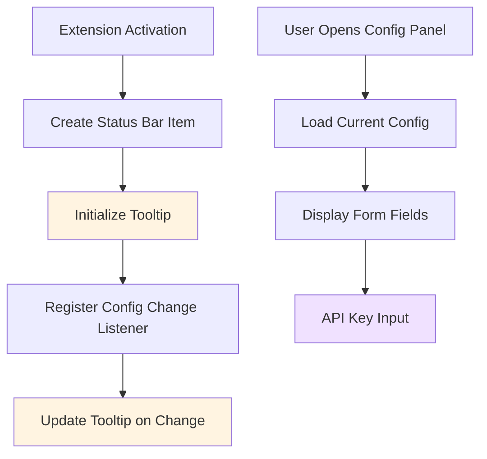

# 设计文档

## 概述

本文档描述了AI Git Commit插件配置界面修复的技术设计。该设计将解决两个关键问题：

1. **状态栏悬停提示问题**: 当前代码已经实现了状态栏tooltip的更新逻辑，但可能存在初始化时机或更新触发的问题，导致悬停提示未正确显示。
2. **API密钥输入框可见性问题**: 配置面板的Webview HTML中API密钥输入框应该始终可见，需要确认HTML结构和JavaScript逻辑没有隐藏该字段。

## 架构

### 当前实现分析



### 问题根因分析

#### 问题1: 状态栏悬停提示未显示

**当前实现**:
- `extension.ts`中已有`updateStatusBarTooltip()`函数
- 在激活时调用一次初始化
- 在配置变更时通过监听器更新

**可能的问题**:
1. 初始化时`getConfigSummary()`可能返回空值或抛出异常
2. `tooltip.isTrusted = true`设置可能不生效
3. 异步调用时机问题，tooltip在设置前被覆盖
4. MarkdownString格式问题导致渲染失败

#### 问题2: API密钥输入框不可见

**当前实现**:
- `ConfigurationPanelManager.ts`的`getWebviewContent()`方法中包含API密钥输入框HTML
- 输入框使用`type="password"`和`required`属性

**可能的问题**:
1. CSS样式问题导致输入框被隐藏
2. JavaScript逻辑错误地隐藏了输入框
3. 提供商切换时的逻辑问题
4. 表单加载时的初始化问题

## 组件和接口

### 1. 状态栏Tooltip修复

**修复策略**:

1. **增强错误处理**
```typescript
async function updateStatusBarTooltip(
    configManager: ConfigurationManager,
    statusBarItem: vscode.StatusBarItem
): Promise<void> {
    try {
        const summary = await configManager.getConfigSummary();
        
        // 确保summary对象有效
        if (!summary) {
            console.warn('Config summary is null or undefined');
            statusBarItem.tooltip = createDefaultTooltip();
            return;
        }
        
        if (!summary.isConfigured) {
            statusBarItem.tooltip = createUnconfiguredTooltip();
            return;
        }
        
        statusBarItem.tooltip = createConfiguredTooltip(summary);
    } catch (error) {
        console.error('Failed to update status bar tooltip:', error);
        statusBarItem.tooltip = createDefaultTooltip();
    }
}
```

2. **分离Tooltip创建逻辑**
```typescript
function createDefaultTooltip(): vscode.MarkdownString {
    const tooltip = new vscode.MarkdownString('**AI Git Commit**\n\n使用AI生成提交信息');
    tooltip.isTrusted = true;
    return tooltip;
}

function createUnconfiguredTooltip(): vscode.MarkdownString {
    const tooltip = new vscode.MarkdownString(
        '**AI Git Commit**\n\n' +
        '⚠️ 未配置\n\n' +
        '点击生成提交信息\n\n' +
        '[配置设置](command:aiGitCommit.configureSettings)'
    );
    tooltip.isTrusted = true;
    return tooltip;
}

function createConfiguredTooltip(summary: ConfigSummary): vscode.MarkdownString {
    const providerName = getProviderDisplayName(summary.provider);
    
    const tooltip = new vscode.MarkdownString(
        '**AI Git Commit**\n\n' +
        '━━━━━━━━━━━━━━━━━━━━\n\n' +
        `**提供商:** ${providerName}\n\n` +
        `**API密钥:** ${summary.apiKeyMasked}\n\n` +
        `**Base URL:** ${summary.baseUrl}\n\n` +
        `**模型:** ${summary.modelName}\n\n` +
        '━━━━━━━━━━━━━━━━━━━━\n\n' +
        '点击生成提交信息\n\n' +
        '[编辑配置](command:aiGitCommit.configureSettings)'
    );
    tooltip.isTrusted = true;
    tooltip.supportHtml = false; // 确保使用Markdown渲染
    return tooltip;
}
```

3. **确保初始化顺序**
```typescript
export async function activate(context: vscode.ExtensionContext) {
    // ... 其他初始化代码 ...
    
    // 创建状态栏项
    statusBarItem = vscode.window.createStatusBarItem(
        vscode.StatusBarAlignment.Left,
        100
    );
    statusBarItem.command = 'aiGitCommit.generateMessage';
    statusBarItem.text = '$(sparkle) AI Commit';
    
    // 设置默认tooltip（同步）
    statusBarItem.tooltip = createDefaultTooltip();
    
    // 只在Git仓库中显示
    if (gitService.isGitRepository()) {
        statusBarItem.show();
    }
    
    // 异步更新tooltip（不阻塞激活）
    updateStatusBarTooltip(configManager, statusBarItem).catch(err => {
        console.error('Failed to initialize status bar tooltip:', err);
    });
    
    // ... 其他代码 ...
}
```

4. **增强配置变更监听**
```typescript
const configChangeListener = configManager.onConfigurationChanged(async (config) => {
    errorHandler.logInfo('配置已更改', 'Extension');
    console.log('Configuration changed:', { ...config, apiKey: '***' });
    
    // 验证新配置
    const validation = await configManager.validateConfig();
    if (!validation.valid) {
        vscode.window.showWarningMessage(
            `配置验证失败: ${validation.errors.join(', ')}`
        );
    }
    
    // 更新状态栏tooltip（添加错误处理）
    try {
        await updateStatusBarTooltip(configManager, statusBarItem);
    } catch (error) {
        console.error('Failed to update tooltip after config change:', error);
    }
});
```

### 2. 配置面板API密钥输入框修复

**修复策略**:

1. **确保HTML结构正确**

检查`getWebviewContent()`方法中的API密钥输入框HTML：

```html
<div class="form-group">
    <label for="api-key" class="required">API密钥</label>
    <input type="password" id="api-key" class="form-control" required>
    <small class="form-text">您的API密钥将安全存储</small>
    <span class="error-text" id="apiKey-error"></span>
</div>
```

**验证点**:
- 输入框没有`display: none`或`visibility: hidden`样式
- 没有条件渲染逻辑隐藏该字段
- 父元素没有隐藏样式

2. **检查CSS样式**

确保CSS不会隐藏输入框：

```css
.form-group {
    margin-bottom: 20px;
    display: block; /* 确保显示 */
}

input {
    width: 100%;
    padding: 8px;
    background-color: var(--vscode-input-background);
    color: var(--vscode-input-foreground);
    border: 1px solid var(--vscode-input-border);
    border-radius: 2px;
    font-family: var(--vscode-font-family);
    font-size: var(--vscode-font-size);
    box-sizing: border-box;
    display: block; /* 确保显示 */
}

/* 确保没有隐藏password类型输入框的样式 */
input[type="password"] {
    display: block !important;
}
```

3. **检查JavaScript逻辑**

确保JavaScript不会隐藏API密钥输入框：

```javascript
// 监听来自Extension的消息
window.addEventListener('message', event => {
    const message = event.data;
    
    switch (message.command) {
        case 'loadConfig':
            providerSelector.value = message.data.provider || 'openai';
            // 确保API密钥输入框始终可见和可编辑
            apiKeyInput.value = message.data.apiKey || '';
            apiKeyInput.style.display = 'block'; // 显式设置
            apiKeyInput.disabled = false; // 确保可编辑
            baseUrlInput.value = message.data.baseUrl || '';
            modelNameInput.value = message.data.modelName || '';
            break;
        
        case 'updateDefaults':
            // 提供商变更时，不隐藏API密钥输入框
            if (message.data.baseUrl) {
                baseUrlInput.value = message.data.baseUrl;
            }
            if (message.data.modelName) {
                modelNameInput.value = message.data.modelName;
            }
            // API密钥输入框保持不变，不清空
            break;
        
        // ... 其他case ...
    }
});

// 提供商变更处理 - 不影响API密钥输入框
providerSelector.addEventListener('change', (e) => {
    vscode.postMessage({
        command: 'providerChanged',
        data: { provider: e.target.value }
    });
    // 不隐藏或禁用API密钥输入框
});
```

4. **添加调试日志**

在关键位置添加日志以诊断问题：

```javascript
// 在Webview脚本开始处
console.log('Webview script loaded');
console.log('API Key Input Element:', apiKeyInput);
console.log('API Key Input Display:', window.getComputedStyle(apiKeyInput).display);
console.log('API Key Input Visibility:', window.getComputedStyle(apiKeyInput).visibility);

// 在loadConfig消息处理中
case 'loadConfig':
    console.log('Loading config:', message.data);
    providerSelector.value = message.data.provider || 'openai';
    apiKeyInput.value = message.data.apiKey || '';
    console.log('API Key Input after load:', {
        value: apiKeyInput.value,
        display: apiKeyInput.style.display,
        disabled: apiKeyInput.disabled
    });
    break;
```

### 3. ConfigurationManager.getConfigSummary()增强

**当前实现检查**:

需要确保`getConfigSummary()`方法正确处理所有情况：

```typescript
async getConfigSummary(): Promise<ConfigSummary> {
    try {
        const fullConfig = await this.getFullConfig();
        
        return {
            provider: fullConfig.provider || 'openai',
            apiKeyMasked: this.maskApiKey(fullConfig.apiKey),
            baseUrl: fullConfig.apiEndpoint || '',
            modelName: fullConfig.modelName || '',
            isConfigured: !!(fullConfig.apiKey && fullConfig.apiEndpoint && fullConfig.modelName)
        };
    } catch (error) {
        console.error('Error getting config summary:', error);
        // 返回默认值而不是抛出异常
        return {
            provider: 'openai',
            apiKeyMasked: '未设置',
            baseUrl: '',
            modelName: '',
            isConfigured: false
        };
    }
}

private maskApiKey(apiKey: string): string {
    if (!apiKey || apiKey.trim() === '') {
        return '未设置';
    }
    if (apiKey.length < 8) {
        return '****';
    }
    return apiKey.substring(0, 4) + '****' + apiKey.substring(apiKey.length - 4);
}
```

## 数据模型

### ConfigSummary接口

```typescript
interface ConfigSummary {
    provider: string;           // API提供商ID
    apiKeyMasked: string;      // 遮蔽后的API密钥
    baseUrl: string;           // Base URL
    modelName: string;         // 模型名称
    isConfigured: boolean;     // 是否已配置
}
```

## 错误处理

### 状态栏Tooltip错误处理

1. **配置加载失败**
   - 捕获异常并记录日志
   - 显示默认tooltip
   - 不阻塞插件激活

2. **配置摘要生成失败**
   - 返回默认ConfigSummary对象
   - 标记为未配置状态
   - 显示"未配置"tooltip

3. **Tooltip更新失败**
   - 记录错误日志
   - 保持当前tooltip不变
   - 不影响其他功能

### 配置面板错误处理

1. **Webview加载失败**
   - 显示错误消息给用户
   - 提供重试选项
   - 记录详细错误日志

2. **配置加载失败**
   - 显示空表单
   - 允许用户输入新配置
   - 显示警告消息

3. **表单验证失败**
   - 在字段下方显示错误提示
   - 使用红色边框标记错误字段
   - 阻止表单提交

## 测试策略

### 单元测试

**状态栏Tooltip测试**:
```typescript
describe('Status Bar Tooltip', () => {
    test('should show default tooltip on initialization', () => {});
    test('should show unconfigured tooltip when config is empty', () => {});
    test('should show configured tooltip with masked API key', () => {});
    test('should update tooltip when config changes', () => {});
    test('should handle getConfigSummary errors gracefully', () => {});
    test('should create trusted MarkdownString', () => {});
});
```

**配置面板测试**:
```typescript
describe('Configuration Panel API Key Input', () => {
    test('should always render API key input field', () => {});
    test('should show API key input for OpenAI provider', () => {});
    test('should show API key input for Azure OpenAI provider', () => {});
    test('should show API key input for Ollama provider', () => {});
    test('should show API key input for custom provider', () => {});
    test('should load existing API key value', () => {});
    test('should not hide API key input on provider change', () => {});
});
```

### 集成测试

**测试场景**:
1. 插件激活 → 检查状态栏tooltip显示
2. 悬停状态栏按钮 → 验证tooltip内容
3. 修改配置 → 验证tooltip自动更新
4. 打开配置面板 → 验证API密钥输入框可见
5. 切换提供商 → 验证API密钥输入框保持可见
6. 输入API密钥 → 验证可以正常输入和保存

### 手动测试清单

- [ ] 插件激活后状态栏显示AI Commit按钮
- [ ] 悬停状态栏按钮显示配置信息tooltip
- [ ] 未配置时tooltip显示"未配置"和配置链接
- [ ] 已配置时tooltip显示完整配置信息
- [ ] 点击tooltip中的"编辑配置"链接打开配置面板
- [ ] 配置面板中API密钥输入框始终可见
- [ ] 选择OpenAI时API密钥输入框可见
- [ ] 选择Azure OpenAI时API密钥输入框可见
- [ ] 选择Ollama时API密钥输入框可见
- [ ] 选择自定义时API密钥输入框可见
- [ ] 切换提供商时API密钥输入框不消失
- [ ] 可以在API密钥输入框中输入内容
- [ ] 保存配置后tooltip自动更新

## 性能考虑

### 优化策略

1. **Tooltip更新防抖**
```typescript
let tooltipUpdateTimer: NodeJS.Timeout | undefined;

function scheduleTooltipUpdate(
    configManager: ConfigurationManager,
    statusBarItem: vscode.StatusBarItem
): void {
    if (tooltipUpdateTimer) {
        clearTimeout(tooltipUpdateTimer);
    }
    
    tooltipUpdateTimer = setTimeout(() => {
        updateStatusBarTooltip(configManager, statusBarItem).catch(err => {
            console.error('Failed to update tooltip:', err);
        });
    }, 100); // 100ms防抖
}
```

2. **配置摘要缓存**
```typescript
class ConfigurationManager {
    private configSummaryCache: ConfigSummary | undefined;
    private cacheTimestamp: number = 0;
    private readonly CACHE_TTL = 5000; // 5秒缓存

    async getConfigSummary(): Promise<ConfigSummary> {
        const now = Date.now();
        if (this.configSummaryCache && (now - this.cacheTimestamp) < this.CACHE_TTL) {
            return this.configSummaryCache;
        }
        
        const summary = await this.generateConfigSummary();
        this.configSummaryCache = summary;
        this.cacheTimestamp = now;
        return summary;
    }
    
    private invalidateCache(): void {
        this.configSummaryCache = undefined;
        this.cacheTimestamp = 0;
    }
}
```

3. **Webview内容缓存**
- 缓存生成的HTML内容
- 仅在必要时重新生成
- 使用模板字符串优化

## 安全考虑

1. **API密钥显示**
   - 在tooltip中使用遮蔽显示
   - 仅显示前4位和后4位
   - 中间使用****替代

2. **日志安全**
   - 不在日志中记录完整API密钥
   - 使用***替代敏感信息
   - 仅在调试模式下记录详细信息

3. **Webview安全**
   - 保持CSP配置
   - 使用nonce防止脚本注入
   - 验证所有消息来源

## UI/UX设计

### 状态栏Tooltip布局

```
┌──────────────────────────────┐
│ AI Git Commit                │
│                              │
│ ━━━━━━━━━━━━━━━━━━━━━━━━━━ │
│                              │
│ 提供商: OpenAI               │
│ API密钥: sk-****abc123       │
│ Base URL: https://api...     │
│ 模型: gpt-3.5-turbo          │
│                              │
│ ━━━━━━━━━━━━━━━━━━━━━━━━━━ │
│                              │
│ 点击生成提交信息             │
│                              │
│ [编辑配置]                   │
└──────────────────────────────┘
```

### 配置面板API密钥字段

```
API密钥 *
┌────────────────────────────────────┐
│ ••••••••••••••••••••••••••••••••  │
└────────────────────────────────────┘
您的API密钥将安全存储
```

## 实现优先级

### Phase 1: 状态栏Tooltip修复（高优先级）
1. 重构tooltip创建逻辑
2. 增强错误处理
3. 确保初始化顺序
4. 添加防抖机制

### Phase 2: 配置面板修复（高优先级）
1. 验证HTML结构
2. 检查CSS样式
3. 审查JavaScript逻辑
4. 添加调试日志

### Phase 3: 测试和验证（中优先级）
1. 编写单元测试
2. 执行集成测试
3. 手动测试验证
4. 性能测试

### Phase 4: 优化和清理（低优先级）
1. 实现缓存机制
2. 添加性能监控
3. 清理调试代码
4. 更新文档

## 向后兼容性

1. **API兼容性**
   - 不修改现有公共接口
   - 新增方法使用可选参数
   - 保持现有行为不变

2. **配置兼容性**
   - 不改变配置存储格式
   - 支持现有配置迁移
   - 保持配置键名不变

3. **用户体验**
   - 不改变现有工作流
   - 增强而不是替换功能
   - 保持向后兼容的行为
