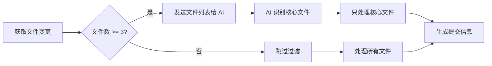

# AI Git Commit

[](https://marketplace.visualstudio.com/items?itemName=SleepSheep.aigitcommit)
[](LICENSE)
[](package.json)
[](https://github.com/want2sleeep/AIGitCommit/actions/workflows/publish.yml)

🚀 **使用AI自动生成高质量的Git提交信息**

AI Git Commit 是一个强大的VSCode扩展，它利用大型语言模型（LLM）自动分析您的代码变更，并生成符合规范的Git提交信息。支持多种AI服务提供商，包括 OpenAI、Google Gemini、Qwen、Ollama、vLLM 及 OpenAI Compatible 兼容服务。

## ✨ 主要特性

### 核心功能
- 🤖 **智能分析**: 自动分析代码变更，生成准确的提交信息
- 🌐 **多提供商支持**: 支持 OpenAI、Google Gemini、Qwen、Ollama、vLLM、OpenAI Compatible 等
- 📝 **规范格式**: 支持约定式提交（Conventional Commits）和简单格式
- 🌍 **多语言**: 支持中文和英文提交信息
- 🔒 **安全存储**: API密钥安全存储在VSCode SecretStorage中
- ⚡ **快速便捷**: 多种触发方式，一键生成提交信息

### 用户体验
- 🎨 **友好界面**: 直观的配置向导和丰富的配置选项
- 👋 **欢迎页面**: 首次使用时显示快速开始指南
- 📊 **实时进度**: 状态栏显示生成进度和预计剩余时间
- 🔍 **预览编辑**: 预览和编辑生成的提交信息，支持一键复制
- 💡 **智能提示**: 详细的错误信息和可操作的解决建议
- 🧪 **连接测试**: 配置时可测试 API 连接是否正常

### 性能优化
- 🚀 **快速启动**: 扩展激活时间 < 500ms
- 💾 **智能缓存**: 配置和数据缓存，减少磁盘 I/O
- 🔄 **请求队列**: 自动管理并发请求，避免 API 限流
- 🧹 **资源管理**: 自动清理资源，防止内存泄漏
- 📈 **性能监控**: 实时监控关键操作的性能指标
- 🎯 **智能过滤**: AI 驱动的文件过滤，自动识别核心逻辑变更

### 国际化支持
- 🌏 **多语言界面**: 完整的中英文界面支持
- 🔤 **自动切换**: 根据 VSCode 语言设置自动切换
- 📝 **本地化消息**: 所有错误和提示信息都已本地化
- 🌐 **易于扩展**: 基于标准 i18n 框架，便于添加新语言

### 安全增强
- 🔐 **加密存储**: API 密钥使用 SecretStorage 加密存储
- 🛡️ **SSL 验证**: 自动验证 HTTPS 连接的 SSL 证书
- 🔒 **信息脱敏**: 日志中自动脱敏 API 密钥和敏感代码
- 🌐 **代理支持**: 支持企业代理和自定义 CA 证书
- 🔑 **最小权限**: 仅请求必要的系统权限

### 功能增强
- 📝 **模板系统**: 自定义提交信息模板，支持变量替换
- 📜 **历史记录**: 查看和管理历史提交信息，支持统计分析
- ⚙️ **配置预设**: 保存和快速切换不同的配置方案
- 🎯 **多候选生成**: 一次生成多个提交信息供选择
- 📋 **格式自定义**: 灵活的提交信息格式配置

### 可观测性
- 📊 **性能监控**: 记录关键操作的响应时间和成功率
- 📝 **详细日志**: 完整的错误上下文和堆栈信息
- 🏥 **健康检查**: 系统状态监控和健康检查接口
- 📤 **日志导出**: 支持导出日志用于问题诊断
- 📈 **使用统计**: 功能使用频率和行为模式分析

## 📸 功能演示

### 一键生成提交信息


*在源代码管理视图中点击 ✨ 按钮，AI 自动分析代码变更并生成规范的提交信息*

### 配置向导


*友好的配置向导，引导您完成初始设置*

### 多提供商支持


*支持多种 AI 服务提供商，灵活选择*

### 提交信息预览


*预览和编辑生成的提交信息，确保完美*

## 🎯 功能亮点

### 🎯 智能文件过滤

#### 什么是智能过滤？

智能文件过滤是一个 AI 驱动的功能，能够自动识别并过滤掉"杂音文件"（如 lockfiles、构建产物、自动生成代码等），只保留核心逻辑变更文件。这样可以：

- **节省 Token**: 避免将大量杂音文件的 diff 发送给 AI
- **提高质量**: 让 AI 专注于核心逻辑变更，生成更准确的提交信息
- **降低成本**: 减少不必要的 API 调用和 token 消耗
- **提升性能**: 减少需要处理的文件数量，加快处理速度

#### 工作原理



#### 自动识别的杂音文件

- **Lockfiles**: package-lock.json, pnpm-lock.yaml, yarn.lock, Gemfile.lock 等
- **构建产物**: dist/, build/, out/, .next/, target/ 等目录下的文件
- **自动生成代码**: *.generated.ts, *.g.cs, *_pb.js 等
- **测试快照**: __snapshots__/, *.snap 等
- **压缩文件**: *.min.js, *.min.css, *.bundle.js 等
- **静态资源**: images/, fonts/ 目录下的 *.png, *.jpg, *.svg 等

#### 使用示例

```typescript
// 场景：大型重构，包含多种文件类型
原始文件列表（25 个）:
  ✓ src/services/UserService.ts      (核心逻辑)
  ✓ src/types/interfaces.ts          (核心逻辑)
  ✓ README.md                         (核心逻辑)
  ✗ package-lock.json                 (lockfile)
  ✗ dist/bundle.min.js                (构建产物)
  ✗ src/generated/api.generated.ts    (自动生成)
  ... 19 个其他文件

智能过滤后（3 个）:
  ✓ src/services/UserService.ts
  ✓ src/types/interfaces.ts
  ✓ README.md

结果:
  Token 节省: ~50%
  处理时间: 减少 40%
  提交信息质量: 显著提升
```

#### 配置选项

```json
{
  // 启用智能过滤
  "aigitcommit.enableSmartFilter": true,
  
  // 最小文件数阈值（少于 3 个文件时跳过过滤）
  "aigitcommit.minFilesThreshold": 3,
  
  // 最大文件列表大小（超过 500 个文件时跳过过滤）
  "aigitcommit.maxFileListSize": 500,
  
  // 过滤超时时间（10 秒）
  "aigitcommit.filterTimeout": 10000,
  
  // 过滤专用模型（留空则自动选择轻量级模型）
  "aigitcommit.filterModel": "",
  
  // 显示过滤统计信息
  "aigitcommit.showFilterStats": true
}
```

#### 模型选择策略

智能过滤会自动选择合适的模型：

- **本地模型**（Ollama、LM Studio）: 直接使用主模型（本地模型不收费）
- **云端模型**（OpenAI、Gemini）: 优先使用轻量级模型降低成本
  - OpenAI: gpt-4o-mini
  - Google: gemini-1.5-flash
  - Anthropic: claude-3-haiku
  - Qwen: qwen-turbo
- **自定义模型**: 可以在配置中指定专用的过滤模型

#### 容错机制

智能过滤采用 "Fail Open" 策略，确保任何错误都不会阻塞您的工作：

- **超时**: 返回原始文件列表
- **解析失败**: 返回原始文件列表
- **空列表**: 返回原始文件列表
- **无效路径**: 过滤掉无效路径，如果全部无效则返回原始列表

#### 性能考虑

- **跳过小文件列表**: 少于 3 个文件时自动跳过过滤
- **跳过超大列表**: 超过 500 个文件时自动跳过过滤
- **轻量级请求**: 只发送文件路径和状态，不发送 diff 内容
- **快速回退**: 任何错误都快速回退，不阻塞后续处理

### 🚀 性能优化

#### 快速启动
- 扩展激活时间 < 500ms
- 异步加载，不阻塞 VSCode 启动
- 智能资源管理，按需加载

#### 智能缓存
```typescript
// 配置缓存示例
缓存命中率: 85%
平均响应时间: 15ms (缓存) vs 150ms (无缓存)
缓存大小: 2.3 MB
```

#### 请求队列
- 自动管理并发请求
- 防止 API 限流
- 智能重试机制

#### 智能文件过滤
```typescript
// 自动过滤杂音文件
原始文件: 25 个
过滤后: 3 个核心文件
Token 节省: ~50%
质量提升: 更准确的提交信息
```

### 🌏 国际化支持

#### 自动语言切换
```typescript
// 根据 VSCode 设置自动切换
VSCode 语言: zh-CN → 扩展界面: 中文
VSCode 语言: en-US → 扩展界面: English
```

#### 完整本地化
- 所有 UI 文本已翻译
- 错误消息本地化
- 配置说明多语言
- 易于添加新语言

### 🔐 安全增强

#### 加密存储
```typescript
// API 密钥安全存储
存储方式: VSCode SecretStorage (加密)
访问控制: 仅扩展可访问
自动清理: 卸载时自动删除
```

#### SSL 验证
- 自动验证 HTTPS 证书
- 支持自定义 CA 证书
- 防止中间人攻击

#### 信息脱敏
```typescript
// 日志自动脱敏
原始: "API Key: sk-1234567890abcdef"
脱敏: "API Key: sk-***"

原始: "Code: const secret = 'password123'"
脱敏: "Code: const secret = '***'"
```

### 📊 可观测性

#### 性能监控
```typescript
// 实时性能指标
操作: 生成提交信息
平均耗时: 2.3s
成功率: 98.5%
最近 100 次调用统计
```

#### 详细日志
```typescript
// 结构化日志
[2024-01-20 15:30:45] [INFO] 开始生成提交信息
[2024-01-20 15:30:46] [DEBUG] 获取 Git diff: 15 个文件变更
[2024-01-20 15:30:47] [INFO] 调用 LLM API: OpenAI GPT-3.5
[2024-01-20 15:30:49] [INFO] 生成成功，耗时: 2.3s
```

#### 健康检查
```typescript
// 系统健康状态
✅ API 连接: 正常
✅ 缓存系统: 正常
✅ 内存使用: 45 MB (正常)
✅ 活跃请求: 0
⚠️ 缓存大小: 2.8 MB (建议清理)
```

### 📝 功能增强

#### 模板系统
```typescript
// 自定义模板
模板名称: "详细提交"
内容:
{{type}}({{scope}}): {{subject}}

详细说明:
{{body}}

影响范围:
- {{impact}}

相关 Issue: {{issue}}
```

#### 历史记录
```typescript
// 历史统计
总提交: 156 条
本周: 23 条
本月: 89 条

最常用类型:
- feat: 45%
- fix: 28%
- docs: 15%
- refactor: 12%
```

#### 配置预设
```typescript
// 快速切换配置
预设 1: "工作项目"
  - 提供商: OpenAI
  - 模型: gpt-4
  - 语言: 中文
  - 格式: Conventional

预设 2: "开源项目"
  - 提供商: OpenAI
  - 模型: gpt-3.5-turbo
  - 语言: 英文
  - 格式: Simple
```

## 📦 安装

### 从VSCode市场安装（推荐）

1. 打开VSCode
2. 按 `Ctrl+Shift+X` 打开扩展面板
3. 搜索 "AI Git Commit"
4. 点击 "安装"

### 从GitHub Release安装（离线安装）

如果无法访问VSCode市场，可以从GitHub Release下载VSIX文件手动安装：

1. 访问 [Releases 页面](https://github.com/want2sleeep/AIGitCommit/releases)
2. 下载最新版本的 `aigitcommit-x.x.x.vsix` 文件
3. 在VSCode中按 `Ctrl+Shift+P`
4. 输入 "Extensions: Install from VSIX"
5. 选择下载的 `.vsix` 文件

**注意**: 每个Release都会自动附带对应版本的VSIX文件，方便离线安装和分发。

## 🚀 快速开始

### 1. 首次使用

安装扩展后，首次激活时会自动显示欢迎页面，引导您完成初始配置。

#### 自动配置向导

1. 打开任意 Git 仓库
2. 扩展会自动检测配置状态
3. 如果未配置，会提示打开配置向导
4. 按照向导步骤完成配置

#### 手动配置

也可以随时手动打开配置：

```bash
# 打开命令面板
Ctrl+Shift+P (Windows/Linux) 或 Cmd+Shift+P (macOS)

# 输入并执行
"配置 AI Git Commit"
```

### 2. 配置 API

配置向导会引导您完成以下步骤：

#### 步骤 1: 选择提供商
- OpenAI (GPT-3.5/GPT-4)
- Google Gemini (Gemini 1.5 Flash)
- Qwen (通义千问)
- Ollama (本地运行)
- vLLM (本地推理)
- OpenAI Compatible (兼容服务)

#### 步骤 2: 配置连接
- **API 端点**: 例如 `https://api.openai.com/v1`
- **API 密钥**: 您的 API 密钥（安全存储）
- **模型名称**: 例如 `gpt-3.5-turbo`

#### 步骤 3: 测试连接
- 点击"测试连接"按钮
- 验证配置是否正确
- 查看详细的诊断信息

#### 步骤 4: 完成配置
- 保存配置
- 开始使用扩展

### 3. 生成提交信息

有三种方式可以使用：

#### 方式1: SCM 视图按钮（推荐）
1. 打开源代码管理视图 (`Ctrl+Shift+G`)
2. 暂存您的代码变更 (点击文件旁的 `+`)
3. 点击标题栏的 ✨ 图标按钮
4. 查看实时进度显示
5. 等待 AI 生成提交信息

#### 方式2: 命令面板
1. 按 `Ctrl+Shift+P`
2. 输入 "生成AI提交信息"
3. 按回车执行
4. 在状态栏查看进度

#### 方式3: 快捷键
1. 按 `Ctrl+Shift+G, C`
2. 等待生成完成

### 4. 预览和编辑

生成后，您可以：
- 📝 **预览**: 在提交信息输入框中查看生成的内容
- ✏️ **编辑**: 直接修改提交信息
- 📋 **复制**: 一键复制到剪贴板
- 🔄 **重新生成**: 如果不满意，可以重新生成

### 5. 高级功能

#### 使用模板
1. 打开命令面板 (`Ctrl+Shift+P`)
2. 输入 "AI Git Commit: 管理模板"
3. 创建自定义模板
4. 在生成时选择模板

#### 查看历史
1. 打开命令面板
2. 输入 "AI Git Commit: 查看历史"
3. 浏览历史提交信息
4. 查看统计数据

#### 配置预设
1. 打开命令面板
2. 输入 "AI Git Commit: 管理配置预设"
3. 保存当前配置为预设
4. 快速切换不同配置

## ⚙️ 配置选项

打开VSCode设置 (`Ctrl+,`)，搜索 "AI Git Commit"：

### 基础配置

| 设置项 | 默认值 | 说明 |
|--------|--------|------|
| `aigitcommit.provider` | `openai` | API提供商 |
| `aigitcommit.apiEndpoint` | `https://api.openai.com/v1` | API端点URL |
| `aigitcommit.modelName` | `gpt-3.5-turbo` | 使用的模型名称 |
| `aigitcommit.language` | `zh-CN` | 提交信息语言 |
| `aigitcommit.commitFormat` | `conventional` | 提交信息格式 |
| `aigitcommit.maxTokens` | `500` | 最大token数 |
| `aigitcommit.temperature` | `0.7` | 温度参数（0-2） |

### 性能配置

| 设置项 | 默认值 | 说明 |
|--------|--------|------|
| `aigitcommit.enableCache` | `true` | 启用配置缓存 |
| `aigitcommit.cacheTimeout` | `300000` | 缓存过期时间（毫秒） |
| `aigitcommit.maxConcurrentRequests` | `3` | 最大并发请求数 |
| `aigitcommit.requestTimeout` | `30000` | 请求超时时间（毫秒） |
| `aigitcommit.enableResourceCleanup` | `true` | 启用自动资源清理 |

### 智能过滤配置

| 设置项 | 默认值 | 说明 |
|--------|--------|------|
| `aigitcommit.enableSmartFilter` | `true` | 启用智能文件过滤 |
| `aigitcommit.minFilesThreshold` | `3` | 最小文件数阈值（少于此数量跳过过滤） |
| `aigitcommit.maxFileListSize` | `500` | 最大文件列表大小（超过此数量跳过过滤） |
| `aigitcommit.filterTimeout` | `10000` | 过滤超时时间（毫秒） |
| `aigitcommit.filterModel` | `""` | 过滤专用模型（留空则自动选择轻量级模型） |
| `aigitcommit.showFilterStats` | `true` | 显示过滤统计信息 |

### 用户体验配置

| 设置项 | 默认值 | 说明 |
|--------|--------|------|
| `aigitcommit.showWelcomePage` | `true` | 首次使用显示欢迎页面 |
| `aigitcommit.showProgressInStatusBar` | `true` | 状态栏显示进度 |
| `aigitcommit.enablePreview` | `true` | 启用提交信息预览 |
| `aigitcommit.autoRedirectToConfiguration` | `true` | 未配置时自动打开配置向导 |

### 安全配置

| 设置项 | 默认值 | 说明 |
|--------|--------|------|
| `aigitcommit.validateSSL` | `true` | 验证SSL证书 |
| `aigitcommit.sanitizeLogs` | `true` | 日志中脱敏敏感信息 |
| `aigitcommit.useSecretStorage` | `true` | 使用加密存储API密钥 |
| `aigitcommit.proxyEnabled` | `false` | 启用代理 |
| `aigitcommit.proxyHost` | `""` | 代理主机 |
| `aigitcommit.proxyPort` | `0` | 代理端口 |

### 功能增强配置

| 设置项 | 默认值 | 说明 |
|--------|--------|------|
| `aigitcommit.enableTemplates` | `true` | 启用模板系统 |
| `aigitcommit.enableHistory` | `true` | 启用历史记录 |
| `aigitcommit.historyLimit` | `100` | 历史记录保存数量 |
| `aigitcommit.enablePresets` | `true` | 启用配置预设 |
| `aigitcommit.numberOfCandidates` | `1` | 生成候选数量（1-5） |

### 可观测性配置

| 设置项 | 默认值 | 说明 |
|--------|--------|------|
| `aigitcommit.enablePerformanceMonitoring` | `true` | 启用性能监控 |
| `aigitcommit.logLevel` | `info` | 日志级别（debug/info/warn/error） |
| `aigitcommit.enableHealthCheck` | `true` | 启用健康检查 |
| `aigitcommit.exportLogsEnabled` | `true` | 允许导出日志 |

### 支持的提供商

- **OpenAI**: 官方API服务，支持GPT-3.5、GPT-4等模型
- **Google Gemini**: Google最新AI模型，支持Gemini 1.5 Flash等
- **Qwen**: 阿里云通义千问大模型服务
- **Ollama**: 本地运行，完全保护代码隐私
- **vLLM**: 高性能本地推理引擎
- **OpenAI Compatible**: 任何 OpenAI 兼容的 API 服务

## 📖 使用示例

### 基础示例

#### 示例1: 添加新功能

```typescript
// 新增函数
export function calculateTotal(items: Item[]): number {
  return items.reduce((sum, item) => sum + item.price, 0);
}
```

**生成的提交信息**:
```
feat(utils): 添加计算总价的函数

实现 calculateTotal 函数用于计算商品列表的总价
```

#### 示例2: 修复Bug

```typescript
// 修复边界条件
- if (user.age > 18) {
+ if (user.age >= 18) {
```

**生成的提交信息**:
```
fix(auth): 修正年龄验证的边界条件

将年龄判断从大于改为大于等于，确保18岁用户可以访问
```

#### 示例3: 重构代码

```typescript
// 重构为箭头函数
- function getUserName(user) {
-   return user.firstName + ' ' + user.lastName;
- }
+ const getUserName = (user: User): string => 
+   `${user.firstName} ${user.lastName}`;
```

**生成的提交信息**:
```
refactor(user): 使用箭头函数和模板字符串重构 getUserName

提高代码可读性并添加类型注解
```

### 高级功能示例

#### 使用自定义模板

创建模板：
```
{{type}}({{scope}}): {{subject}}

{{body}}

{{footer}}
```

应用模板生成：
```
feat(api): 添加用户认证接口

实现基于 JWT 的用户认证系统，包括登录、注册和令牌刷新功能

Closes #123
```

#### 多候选生成

一次生成 3 个候选提交信息：
```
候选 1: feat(auth): 实现 JWT 认证系统
候选 2: feat(security): 添加用户身份验证功能
候选 3: feat(api): 集成 JWT 令牌认证
```

选择最合适的一个或组合使用。

#### 查看历史统计

```
📊 提交信息历史统计

总计: 156 条
成功: 152 条 (97.4%)
失败: 4 条 (2.6%)

最常用提供商: OpenAI (89%)
最常用模型: gpt-3.5-turbo (76%)
平均消息长度: 87 字符

最近使用:
- 2024-01-20 15:30: feat(ui): 添加深色模式支持
- 2024-01-20 14:15: fix(api): 修复超时错误处理
- 2024-01-20 13:45: docs: 更新 README 文档
```

#### 配置预设切换

保存不同场景的配置：
```
预设 1: "工作项目" (OpenAI GPT-4, 中文)
预设 2: "开源项目" (OpenAI GPT-3.5, 英文)
预设 3: "本地开发" (Ollama, 中文)
```

一键切换，无需重新配置。

## 🔧 配置示例

### OpenAI配置

```json
{
  "aigitcommit.provider": "openai",
  "aigitcommit.apiEndpoint": "https://api.openai.com/v1",
  "aigitcommit.modelName": "gpt-3.5-turbo",
  "aigitcommit.language": "zh-CN",
  "aigitcommit.commitFormat": "conventional"
}
```

### Google Gemini配置

```json
{
  "aigitcommit.provider": "gemini",
  "aigitcommit.apiEndpoint": "https://generativelanguage.googleapis.com/v1beta",
  "aigitcommit.modelName": "gemini-1.5-flash",
  "aigitcommit.language": "zh-CN"
}
```

### Qwen配置

```json
{
  "aigitcommit.provider": "qwen",
  "aigitcommit.apiEndpoint": "https://dashscope.aliyuncs.com/compatible-mode/v1",
  "aigitcommit.modelName": "qwen-turbo",
  "aigitcommit.language": "zh-CN"
}
```

### Ollama配置

```json
{
  "aigitcommit.provider": "ollama",
  "aigitcommit.apiEndpoint": "http://localhost:11434/v1",
  "aigitcommit.modelName": "codellama",
  "aigitcommit.language": "zh-CN"
}
```

### vLLM配置

```json
{
  "aigitcommit.provider": "vllm",
  "aigitcommit.apiEndpoint": "http://localhost:8000/v1",
  "aigitcommit.modelName": "meta-llama/Llama-2-7b-chat-hf",
  "aigitcommit.language": "zh-CN"
}
```

## 🎯 使用场景

### 个人开发者
- **推荐配置**: Ollama + Code Llama 或 vLLM + Llama 2
- **优势**: 完全免费，代码不离开本地，隐私保护
- **适用场景**: 个人项目、学习练习、敏感代码
- **性能**: 本地运行，无网络延迟

### 小团队
- **推荐配置**: OpenAI GPT-3.5
- **优势**: 性价比高，响应速度快，质量稳定
- **适用场景**: 创业团队、小型项目、快速迭代
- **成本**: 约 $0.002/次（1000 tokens）

### 企业团队
- **推荐配置**: Qwen（通义千问）
- **优势**: 国内访问快速，价格实惠，支持中文优化
- **适用场景**: 企业内部项目、中文为主的项目
- **安全**: 支持企业代理、自定义 CA 证书
- **合规**: 符合国内数据安全要求

### 开源项目
- **推荐配置**: OpenAI GPT-4 + 英文提交
- **优势**: 最佳质量，国际化支持，社区认可
- **适用场景**: 国际开源项目、高质量要求
- **建议**: 使用英文提交信息，便于国际协作

### 混合场景
- **推荐配置**: 配置预设 + 快速切换
- **场景 1**: 工作项目（Qwen + 中文）
- **场景 2**: 开源项目（OpenAI + 英文）
- **场景 3**: 本地测试（Ollama + 中文）
- **优势**: 一键切换，灵活应对不同需求

## 💡 最佳实践

### 提交信息质量

#### 1. 保持代码变更聚焦
```bash
# ✅ 好的做法：单一功能的变更
git add src/auth/login.ts
# 生成: feat(auth): 添加用户登录功能

# ❌ 避免：混合多个不相关的变更
git add src/auth/* src/ui/* src/api/*
# 生成: feat: 添加多个功能（不够清晰）
```

#### 2. 适当的变更粒度
- **太小**: 每行代码一个提交（过于琐碎）
- **太大**: 整个功能一个提交（难以审查）
- **合适**: 一个逻辑完整的功能单元

#### 3. 使用模板保持一致性
```typescript
// 团队统一模板
{{type}}({{scope}}): {{subject}}

{{body}}

Reviewed-by: {{reviewer}}
Closes: {{issue}}
```

### 性能优化建议

#### 1. 启用缓存
```json
{
  "aigitcommit.enableCache": true,
  "aigitcommit.cacheTimeout": 300000  // 5分钟
}
```

#### 2. 合理设置并发
```json
{
  "aigitcommit.maxConcurrentRequests": 3  // 避免API限流
}
```

#### 3. 定期清理历史
```bash
# 保留最近100条记录
"aigitcommit.historyLimit": 100
```

### 安全最佳实践

#### 1. 使用本地模型处理敏感代码
```json
{
  "aigitcommit.provider": "ollama",
  "aigitcommit.apiEndpoint": "http://localhost:11434/v1"
}
```

#### 2. 启用所有安全功能
```json
{
  "aigitcommit.validateSSL": true,
  "aigitcommit.sanitizeLogs": true,
  "aigitcommit.useSecretStorage": true
}
```

#### 3. 企业环境配置代理
```json
{
  "aigitcommit.proxyEnabled": true,
  "aigitcommit.proxyHost": "proxy.company.com",
  "aigitcommit.proxyPort": 8080
}
```

### 团队协作建议

#### 1. 统一配置预设
```typescript
// 团队共享配置
预设名称: "团队标准"
- 提供商: Qwen
- 语言: 中文
- 格式: Conventional
- 模板: 团队统一模板
```

#### 2. 代码审查集成
```bash
# 提交信息包含审查信息
feat(api): 添加用户API

实现用户CRUD接口

Reviewed-by: @reviewer
Closes: #123
```

#### 3. 持续改进
- 定期查看历史统计
- 分析常见提交类型
- 优化模板和配置
- 收集团队反馈

### 故障排除技巧

#### 1. 使用健康检查
```bash
命令面板 → "AI Git Commit: 健康检查"
```

#### 2. 导出日志诊断
```bash
命令面板 → "AI Git Commit: 导出日志"
```

#### 3. 测试连接
```bash
配置向导 → "测试连接" 按钮
```

#### 4. 查看性能指标
```bash
命令面板 → "AI Git Commit: 性能统计"
```

## 🛠️ 开发

### 环境要求

- Node.js >= 16.x
- pnpm >= 8.0.0
- VSCode >= 1.85.0
- TypeScript >= 5.3.3

### 安装 pnpm

如果您还没有安装 pnpm，请先安装：

```bash
# 使用 npm 安装
npm install -g pnpm

# 或使用 Homebrew (macOS)
brew install pnpm

# 或使用 Scoop (Windows)
scoop install pnpm
```

### 本地开发

```bash
# 克隆仓库
git clone https://github.com/want2sleeep/AIGitCommit.git
cd AIGitCommit

# 安装依赖
pnpm install

# 类型检查（不生成文件）
pnpm run type-check

# 类型检查（监听模式）
pnpm run type-check:watch

# 运行测试
pnpm test

# 启动开发模式（监听文件变化）
pnpm run watch

# 代码检查
pnpm run lint

# 代码格式化
pnpm run format
```

### 构建系统

本项目使用 **esbuild** 作为生产构建工具，提供极快的构建速度和优化的包体积：

#### esbuild 优势

- ⚡ **极速构建**: 比 TypeScript 编译器快 10-100 倍
- 📦 **更小体积**: 生产包体积减少约 20-30%
- 🔄 **Watch 模式**: 开发时自动重新构建
- 🎯 **Tree Shaking**: 自动移除未使用的代码
- 🗜️ **代码压缩**: 生产模式自动压缩代码

#### 构建命令

```bash
# 类型检查（不生成文件）
pnpm run type-check

# 类型检查（监听模式）
pnpm run type-check:watch

# 生产构建（用于发布）
pnpm run package

# 完整构建（类型检查 + 打包）
pnpm run build

# 开发构建（带 watch 模式）
pnpm run compile-watch

# 准备发布（运行完整构建和检查）
pnpm run vscode:prepublish
```

#### 构建配置

esbuild 配置位于 `esbuild.js` 文件：

- **入口文件**: `src/extension.ts`
- **输出文件**: `dist/extension.js`
- **格式**: CommonJS (cjs)
- **平台**: Node.js
- **外部依赖**: vscode（由 VSCode 提供）
- **生产模式**: 启用代码压缩，禁用 sourcemap
- **开发模式**: 保留 sourcemap，便于调试

### 开发指南

#### 代码质量

本项目使用以下工具确保代码质量：

- **ESLint**: 代码规范检查
- **Prettier**: 代码格式化
- **Husky**: Git 钩子管理
- **lint-staged**: 提交前代码检查

在提交代码前，pre-commit 钩子会自动运行：
1. ESLint 检查并自动修复问题
2. Prettier 格式化代码
3. 运行测试套件

#### 开发流程

1. **创建分支**: 从 `main` 分支创建功能分支
   ```bash
   git checkout -b feature/your-feature-name
   ```

2. **开发功能**: 编写代码并确保通过所有检查
   ```bash
   pnpm run type-check  # 类型检查
   pnpm run lint        # 检查代码规范
   pnpm test            # 运行测试
   pnpm run build       # 完整构建
   ```

3. **提交代码**: 使用约定式提交格式
   ```bash
   git add .
   git commit -m "feat: add new feature"
   ```

4. **推送代码**: 推送到远程仓库
   ```bash
   git push origin feature/your-feature-name
   ```

5. **创建 PR**: 在 GitHub 上创建 Pull Request

#### 测试

```bash
# 运行所有测试
pnpm test

# 监听模式（开发时使用）
pnpm run test:watch

# 生成覆盖率报告
pnpm run test:coverage
```

测试文件位于 `src/__tests__/` 目录，使用 Jest 测试框架。

#### 调试

在 VSCode 中按 `F5` 启动调试模式：
1. 会打开一个新的 VSCode 窗口（Extension Development Host）
2. 在新窗口中测试扩展功能
3. 可以在原窗口中设置断点进行调试

#### 打包

```bash
# 编译并打包扩展
pnpm run vscode:prepublish

# 使用 vsce 打包（需要先安装 vsce）
pnpm install -g @vscode/vsce
vsce package
```

### 项目结构

```
src/
├── extension.ts           # 扩展入口
├── constants.ts           # 常量定义
├── services/              # 服务层
│   ├── ConfigurationManager.ts
│   ├── GitService.ts
│   ├── LLMService.ts
│   ├── CommandHandler.ts
│   └── ProviderManager.ts
├── utils/                 # 工具类
│   ├── ErrorHandler.ts
│   └── UIManager.ts
├── types/                 # 类型定义
│   └── index.ts
└── __tests__/             # 测试文件
```

## 📚 完整文档

📖 **[文档中心](docs/README.md)** - 查看所有完整文档

### 快速链接
- [🚀 快速开始](docs/guides/quick-start.md) - 5分钟上手
- [⚙️ 配置指南](docs/configuration/README.md) - 选择AI服务
- [🤝 贡献代码](CONTRIBUTING.md) - 参与项目开发
- [📋 更新日志](CHANGELOG.md) - 版本历史

## 🐛 故障排除

### 常见问题

#### Q: 提示"无暂存变更"
**A**: 需要先暂存文件变更
- 使用 `git add <file>` 命令
- 或在源代码管理视图中点击文件旁的 `+` 按钮
- 确保至少有一个文件被暂存

#### Q: API 调用失败
**A**: 检查以下几点
1. **API 端点**: 确认 URL 正确且可访问
2. **API 密钥**: 验证密钥有效且未过期
3. **网络连接**: 检查网络连接和防火墙设置
4. **代理配置**: 如在企业环境，配置代理设置
5. **查看日志**: 打开输出面板查看详细错误信息

使用配置向导中的"测试连接"功能可以快速诊断问题。

#### Q: 找不到命令
**A**: 尝试以下解决方案
1. 重启 VSCode
2. 确认扩展已启用（扩展面板中查看）
3. 确保在 Git 仓库中工作
4. 检查命令面板中是否能搜索到 "AI Git Commit"

#### Q: 生成的提交信息不满意
**A**: 有多种改进方式
1. **重新生成**: 点击重新生成按钮获取新的提交信息
2. **手动编辑**: 直接在输入框中修改内容
3. **调整参数**: 在设置中调整温度参数（0-2）
   - 较低值（0.3-0.7）：更确定、更保守
   - 较高值（0.7-1.5）：更有创意、更多样
4. **使用模板**: 创建自定义模板以获得一致的格式
5. **切换模型**: 尝试不同的 AI 模型

#### Q: 扩展启动慢
**A**: 优化建议
1. 检查是否有大量缓存数据，可以清理缓存
2. 确保 VSCode 版本 >= 1.85.0
3. 检查其他扩展是否冲突
4. 查看性能监控数据（如果启用）

#### Q: 国际化显示问题
**A**: 语言设置
1. 检查 VSCode 语言设置（`Ctrl+,` 搜索 "language"）
2. 扩展会自动跟随 VSCode 语言设置
3. 支持的语言：中文（zh-CN）、英文（en-US）
4. 如需添加新语言，欢迎贡献翻译

#### Q: 安全和隐私问题
**A**: 安全保障
1. **API 密钥**: 使用 VSCode SecretStorage 加密存储
2. **代码隐私**: 使用 Ollama 可完全本地运行
3. **日志脱敏**: 自动脱敏日志中的敏感信息
4. **SSL 验证**: 自动验证 HTTPS 连接
5. **最小权限**: 仅请求必要的系统权限

#### Q: 智能过滤没有生效
**A**: 检查以下几点
1. **启用状态**: 确认 `aigitcommit.enableSmartFilter` 设置为 `true`
2. **文件数量**: 确保文件数量在 3-500 之间（太少或太多会跳过过滤）
3. **查看日志**: 在输出面板查看过滤统计信息
4. **模型配置**: 确认 AI 模型配置正确且可访问

#### Q: 智能过滤过滤掉了重要文件
**A**: 调整策略
1. **禁用过滤**: 临时禁用智能过滤 `aigitcommit.enableSmartFilter: false`
2. **查看统计**: 检查输出面板中的过滤统计，了解哪些文件被过滤
3. **反馈问题**: 如果 AI 错误过滤了重要文件，请提交 Issue 帮助改进
4. **手动选择**: 可以手动暂存需要的文件，然后生成提交信息

#### Q: 智能过滤速度慢
**A**: 优化建议
1. **检查超时**: 默认超时 10 秒，可以适当调整 `aigitcommit.filterTimeout`
2. **使用本地模型**: 本地模型（Ollama）响应更快
3. **检查网络**: 确保网络连接稳定
4. **查看日志**: 检查是否有重试或错误

### 性能问题

#### 激活时间过长
- 正常激活时间应 < 500ms
- 如果超过，检查是否有网络请求阻塞
- 查看性能监控数据定位问题

#### 内存占用高
- 检查历史记录数量，定期清理
- 检查缓存大小，必要时清空
- 查看资源管理器中的内存使用情况

### 诊断工具

#### 查看详细日志
1. 打开输出面板：`View` > `Output`
2. 选择 "AI Git Commit" 频道
3. 查看详细的操作日志和错误信息

#### 导出日志
1. 打开命令面板 (`Ctrl+Shift+P`)
2. 输入 "AI Git Commit: 导出日志"
3. 保存日志文件用于问题诊断

#### 健康检查
1. 打开命令面板
2. 输入 "AI Git Commit: 健康检查"
3. 查看系统状态报告

### CI/CD 工作流问题

如果您在贡献代码时遇到 GitHub Actions 工作流失败，请参考：
- [工作流故障排查指南](.github/TROUBLESHOOTING.md) - 详细的诊断和解决方案

### 获取帮助

如果以上方法都无法解决问题：

1. **查看文档**: [完整文档](docs/README.md)
2. **搜索 Issues**: [GitHub Issues](https://github.com/want2sleeep/AIGitCommit/issues)
3. **提交 Issue**: 提供详细的错误信息和日志
4. **联系作者**: victorhuang.hy@gmail.com

提交 Issue 时，请包含：
- VSCode 版本
- 扩展版本
- 操作系统
- 错误信息和日志
- 复现步骤

## 🤝 贡献

欢迎贡献代码、报告问题或提出建议！请查看 [贡献指南](CONTRIBUTING.md) 了解详细信息。

### 快速开始

1. Fork 项目
2. 克隆到本地: `git clone https://github.com/YOUR_USERNAME/AIGitCommit.git`
3. 安装依赖: `pnpm install`
4. 创建特性分支: `git checkout -b feature/AmazingFeature`
5. 提交更改: `git commit -m 'feat: add some amazing feature'`
6. 推送到分支: `git push origin feature/AmazingFeature`
7. 开启 Pull Request

### 开发规范

- 遵循 TypeScript 编码规范
- 使用约定式提交格式（Conventional Commits）
- 编写单元测试（目标覆盖率 70%+）
- 更新相关文档
- 确保所有测试和检查通过
- 代码提交前会自动运行 lint 和格式化

### 发布流程

维护者发布新版本时，请参考 [发布指南](.github/PUBLISHING.md)：

1. 更新 `package.json` 版本号
2. 更新 `CHANGELOG.md`
3. 创建 GitHub Release
4. 自动发布到 VS Code 插件市场

## 📄 许可

本项目采用 MIT 许可证 - 查看 [LICENSE](LICENSE) 文件了解详情。

## 🙏 致谢

- [Conventional Commits](https://www.conventionalcommits.org/) - 提交信息规范
- [OpenAI](https://openai.com/) - 强大的AI模型支持
- [VSCode API](https://code.visualstudio.com/api) - 扩展开发框架

## 📞 联系方式

- **作者**: SleepSheep
- **邮箱**: victorhuang.hy@gmail.com
- **GitHub**: [SleepSheep](https://github.com/want2sleeep)
- **问题反馈**: [GitHub Issues](https://github.com/want2sleeep/AIGitCommit/issues)

---

⭐ 如果这个项目对您有帮助，请给我们一个星标！

🚀 **让AI帮您写出更好的提交信息！**